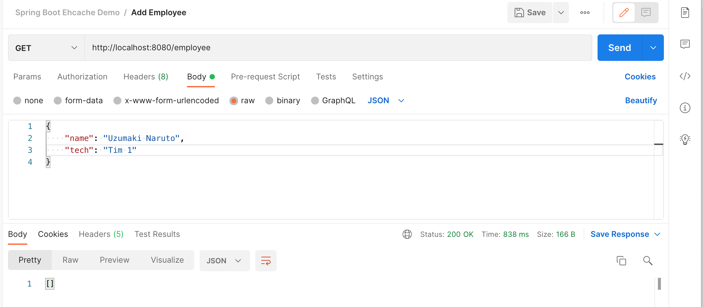
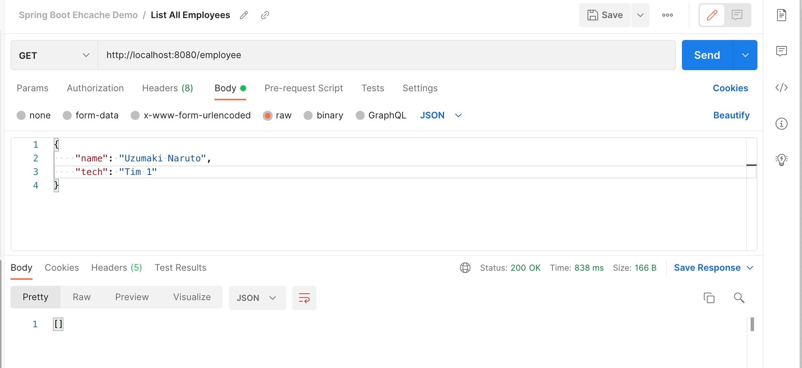
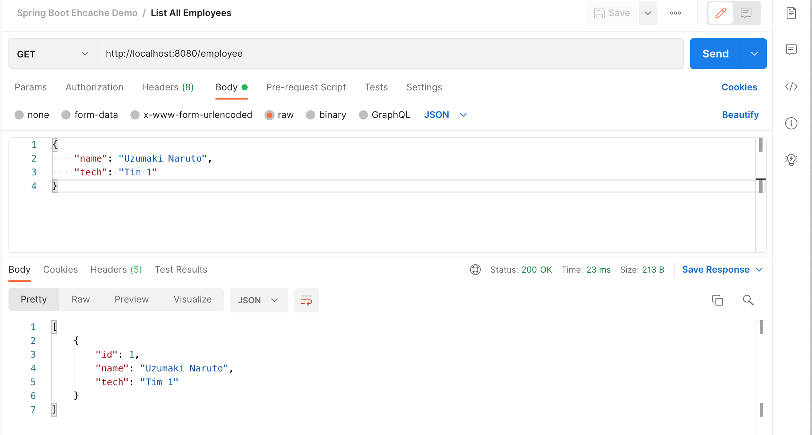
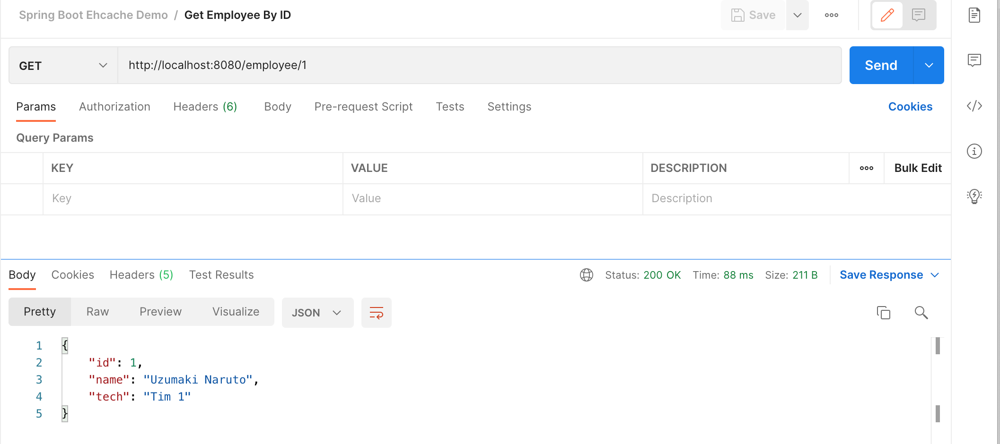
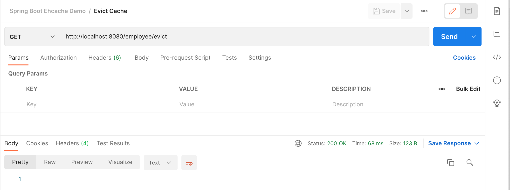

# springboot-ehcache-demo

### Things todo list

1. Clone this repository: `git clone https://github.com/hendisantika/springboot-ehcache-demo.git`
2. Navigate to the folder: `cd springboot-ehcache-demo`
3. Run the application: `mvn clean spring-boot:run`
4. Open your POSTMAN APP then import the file

### Image Screen shot

Add New Employee



```shell
curl --location --request POST 'http://localhost:8080/employee' \
--header 'Content-Type: application/json' \
--data-raw '{
    "name": "Uchiha Sasuke",
    "tech": "Tim 1"
}'
```

List All Employee





```shell
curl --location --request GET 'http://localhost:8080/employee' \
--header 'Content-Type: application/json' \
--data-raw '{
    "name": "Uzumaki Naruto",
    "tech": "Tim 1"
}'
```

Find Employee By ID



```shell
curl --location --request GET 'http://localhost:8080/employee/1'
```

Evict the Cache



```shell
curl --location --request GET 'http://localhost:8080/employee/evict'
```
